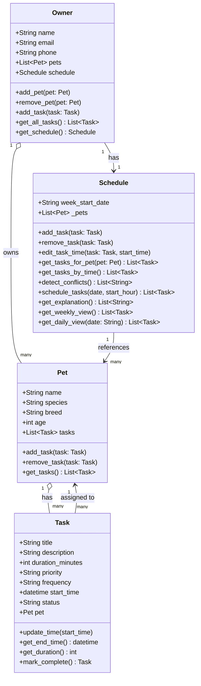

```mermaid
classDiagram
    class Owner {
        +String name
        +String email
        +String phone
        +List~Pet~ pets
        +Schedule schedule
        +add_pet(pet: Pet)
        +remove_pet(pet: Pet)
        +add_task(task: Task)
        +get_all_tasks() List~Task~
        +get_schedule() Schedule
    }

    class Pet {
        +String name
        +String species
        +String breed
        +int age
        +List~Task~ tasks
        +add_task(task: Task)
        +remove_task(task: Task)
        +get_tasks() List~Task~
    }

    class Task {
        +String title
        +String description
        +int duration_minutes
        +String priority
        +String frequency
        +datetime start_time
        +String status
        +Pet pet
        +update_time(start_time)
        +get_end_time() datetime
        +get_duration() int
        +mark_complete() Task
    }

    class Schedule {
        +String week_start_date
        +List~Pet~ _pets
        +add_task(task: Task)
        +remove_task(task: Task)
        +edit_task_time(task: Task, start_time)
        +get_tasks_for_pet(pet: Pet) List~Task~
        +get_tasks_by_time() List~Task~
        +detect_conflicts() List~String~
        +schedule_tasks(date, start_hour) List~Task~
        +get_explanation() List~String~
        +get_weekly_view() List~Task~
        +get_daily_view(date: String) List~Task~
    }

    Owner "1" --> "1" Schedule : has
    Owner "1" o-- "many" Pet : owns
    Schedule "1" --> "many" Pet : references
    Pet "1" o-- "many" Task : has
    Task "many" --> "1" Pet : assigned to
```
