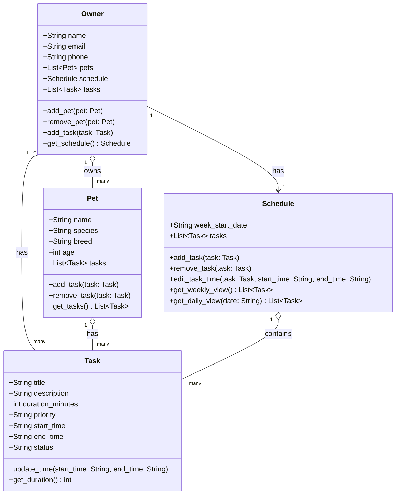

```mermaid
classDiagram
    class Owner {
        +String name
        +String email
        +String phone
        +List~Pet~ pets
        +Schedule schedule
        +List~Task~ tasks
        +add_pet(pet: Pet)
        +remove_pet(pet: Pet)
        +add_task(task: Task)
        +get_schedule() Schedule
    }

    class Pet {
        +String name
        +String species
        +String breed
        +int age
        +List~Task~ tasks
        +add_task(task: Task)
        +remove_task(task: Task)
        +get_tasks() List~Task~
    }

    class Task {
        +String title
        +String description
        +int duration_minutes
        +String priority
        +String start_time
        +String end_time
        +String status
        +update_time(start_time: String, end_time: String)
        +get_duration() int
    }

    class Schedule {
        +String week_start_date
        +List~Task~ tasks
        +add_task(task: Task)
        +remove_task(task: Task)
        +edit_task_time(task: Task, start_time: String, end_time: String)
        +get_weekly_view() List~Task~
        +get_daily_view(date: String) List~Task~
    }

    Owner "1" --> "1" Schedule : has
    Owner "1" o-- "many" Pet : owns
    Owner "1" o-- "many" Task : has
    Pet "1" o-- "many" Task : has
    Schedule "1" o-- "many" Task : contains
```
